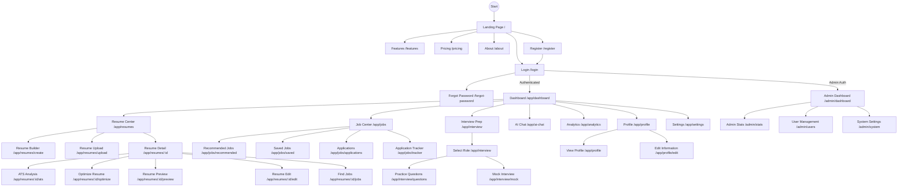

# User Navigation Diagram

This diagram illustrates the user navigation flow within the GrobsAI application.

```mermaid
graph TD
    %% Public Routes
    Start((Start)) --> LandingPage[Landing Page /]
    LandingPage --> Features[Features /features]
    LandingPage --> Pricing[Pricing /pricing]
    LandingPage --> About[About /about]
    
    %% Auth Routes
    LandingPage --> Login[Login /login]
    LandingPage --> Register[Register /register]
    Register --> Login
    Login --> ForgotPassword[Forgot Password /forgot-password]
    
    %% Main App (Protected)
    Login -- Authenticated --> Dashboard[Dashboard /app/dashboard]
    
    Dashboard --> ResumeCenter[Resume Center /app/resumes]
    Dashboard --> JobCenter[Job Center /app/jobs]
    Dashboard --> InterviewPrep[Interview Prep /app/interview]
    Dashboard --> AIChat[AI Chat /app/ai-chat]
    Dashboard --> Analytics[Analytics /app/analytics]
    
    %% Resume Center Detail
    ResumeCenter --> ResumeBuilder[Resume Builder /app/resumes/create]
    ResumeCenter --> ResumeUpload[Resume Upload /app/resumes/upload]
    ResumeCenter --> ResumeDetail[Resume Detail /app/resumes/:id]
    ResumeDetail --> ATSAnalysis[ATS Analysis /app/resumes/:id/ats]
    ResumeDetail --> OptimizeResume[Optimize Resume /app/resumes/:id/optimize]
    ResumeDetail --> ResumePreview[Resume Preview /app/resumes/:id/preview]
    ResumeDetail --> ResumeEdit[Resume Edit /app/resumes/:id/edit]
    ResumeDetail --> FindJobs[Find Jobs /app/resumes/:id/jobs]
    
    %% Job Center Detail
    JobCenter --> RecommendedJobs[Recommended Jobs /app/jobs/recommended]
    JobCenter --> SavedJobs[Saved Jobs /app/jobs/saved]
    JobCenter --> Applications[Applications /app/jobs/applications]
    JobCenter --> AppTracker[Application Tracker /app/jobs/tracker]
    
    %% Interview Prep Detail
    InterviewPrep --> SelectRole[Select Role /app/interview]
    SelectRole --> PracticeQuestions[Practice Questions /app/interview/questions]
    SelectRole --> MockInterview[Mock Interview /app/interview/mock]
    
    %% Profile & Settings
    Dashboard --> Profile[Profile /app/profile]
    Profile --> ViewProfile[View Profile /app/profile]
    Profile --> ProfileEdit[Edit Information /app/profile/edit]
    Dashboard --> Settings[Settings /app/settings]
    
    %% Admin Routes
    Login -- Admin Auth --> AdminDashboard[Admin Dashboard /admin/dashboard]
    AdminDashboard --> AdminStats[Admin Stats /admin/stats]
    AdminDashboard --> AdminUsers[User Management /admin/users]
    AdminDashboard --> AdminSystem[System Settings /admin/system]
```
